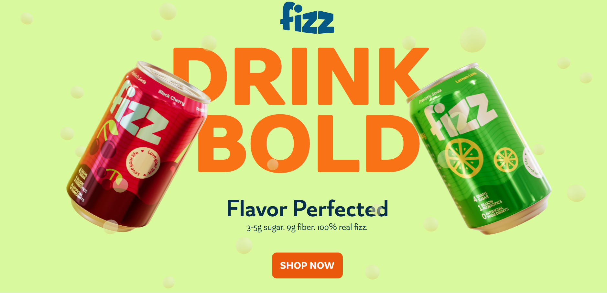

# 🥤 Fizz - The Soda Revolution

**Fizz** is a bold, modern soda brand website built from scratch using cutting-edge technologies like **Next.js**, **TypeScript**, **Three.js**, **GSAP**, and **Lenis Smooth Scroll**. Designed for a hackathon, this project combines fluid 3D visuals, smooth scroll-based animations, and premium UI to deliver a next-gen beverage experience.

 <!-- Add your preview image -->

---

## 🚀 Live Demo

🔗 [Visit the Website](https://fizz-soda.vercel.app/)

---

## ⚙️ Tech Stack

| Technology     | Usage                                    |
|----------------|------------------------------------------|
| **Next.js**    | React framework for SSR + routing        |
| **TypeScript** | Type-safe development                    |
| **Three.js**   | WebGL-powered 3D object rendering        |
| **@react-three/fiber (R3F)** | React renderer for Three.js |
| **GSAP + ScrollTrigger** | Scroll-based and timeline animations |
| **Lenis**      | Smooth scrolling UX                      |
| **Tailwind CSS / SCSS** | Modern utility-first styling     |

---

## 🧠 Concept

> "Fizz is not just a drink — it's an animated experience, crafted to engage users like never before."

The entire interface is built with a combination of scroll-based transitions, 3D can animations, and fluid interactions — making the website not just informative but unforgettable.

---

## 🧩 Features

- 🧊 3D Soda Can built using `Three.js + R3F`
- 🌀 Smooth scroll experience with `Lenis`
- 🎬 Scroll-based animations powered by `GSAP + ScrollTrigger`
- 🎨 Neon-glow violet-pink theme for premium brand feel
- 🔗 Modular architecture using `Next.js` pages + slices
- 📱 Mobile-first responsive layout
- 🧠 Custom React hooks for viewport, store, etc.
- 🚀 Zero-template build — 100% from scratch

---

## 📁 Project Structure

```bash
fizz/
├── public/
│   └── assets/                # Logos, textures, previews
├── src/
│   ├── app/                   # app.css, layout.tsx (global layout & styles)
│   ├── components/            # UI elements like Buttons, Footer, Header
│   ├── slices/                # Section components: Hero, Carousel, etc.
│   ├── hooks/                 # Custom hooks like useStore, useMediaQuery
│   ├── prismicio.ts           # CMS/data integration file (if used)
│   ├── index.tsx              # Root entry
│   └── main.tsx               # App render
├── .eslintrc.json
├── .prettierrc
├── package.json
└── README.md
